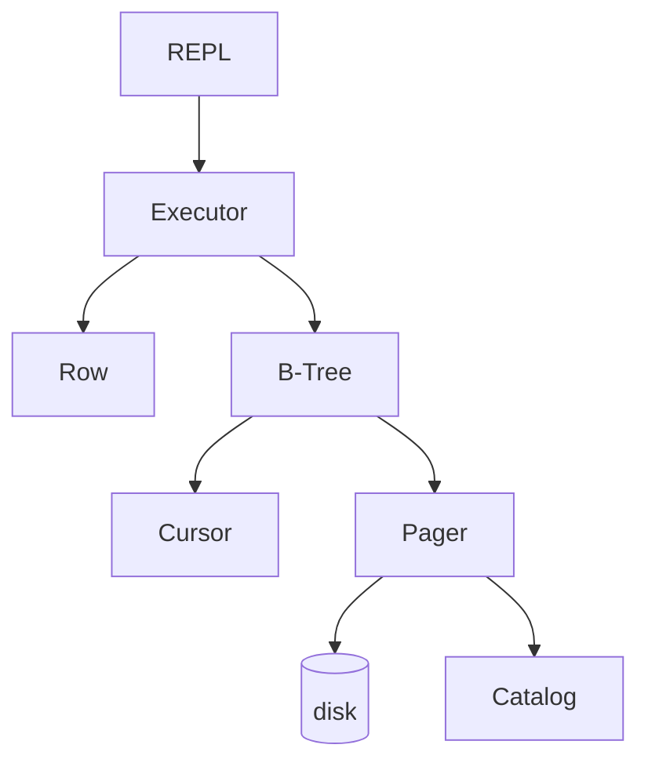

# SimpleDB

用 C 從零實作的關聯式資料庫，支援 B-Tree 索引與資料持久化。

---

## 架構



| 模組 | 負責 |
|------|------|
| REPL | 讀輸入、tokenize、dispatch |
| Executor | INSERT / SELECT / UPDATE / DELETE |
| Row | serialize / deserialize |
| B-Tree | 索引、搜尋、split / merge |
| Cursor | B-Tree 上的位置指標 |
| Pager | page cache，dirty page 才寫回 disk |
| Catalog | table schema，持久化在 Page 0 |

---

## 指令

```
create table <name> (<col> <type>, ...)
drop table <name>
describe <table>

insert <table> <id> <val>...
select * from <table> [where <col> <op> <val>]
select <col1>, <col2> from <table>
update <table> <id> <val>...
delete <table> <id>

.list
.btree <table>
.exit
```

WHERE 支援 `=` `>` `<` `>=` `<=`，TEXT 欄位只支援 `=` `>` `<`。

---

## Build

```bash
# 需要 gcc、libreadline
make
./simpledb mydb.db
```

```bash
# 跑測試
make -C tests run
```
